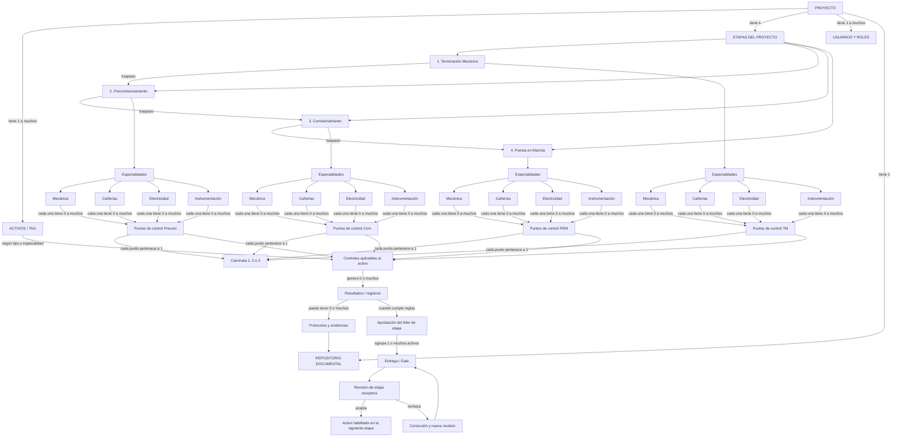

# Diagrama conceptual del proyecto — versión 1

Estado: **borrador para validación**. Fuente: demo oficial F-012.

## Lectura del modelo

- Un proyecto tiene uno o muchos activos.
- Un proyecto recorre cuatro etapas en orden: TM, Precomisionamiento, Comisionamiento y PEM.
- Cada etapa organiza sus controles por cuatro especialidades.
- Cada especialidad puede tener muchos puntos de control.
- Cada punto de control pertenece a una etapa, una especialidad y una caminata.
- Los puntos de control se asignan a los activos según su tipo, especialidad y aplicabilidad.
- Un control aplicado a un activo genera resultados y puede incorporar protocolos o evidencias.
- Cuando el activo cumple las reglas de la etapa, pasa a aprobación y luego a una entrega.
- La etapa receptora acepta el activo o lo devuelve para corrección.
- Los documentos generados quedan asociados al repositorio del proyecto.

## Aclaración estructural

Las cuatro etapas pertenecen al proyecto. Un punto de control específico pertenece a **una** etapa y a **una** especialidad; no es el mismo punto de control repetido obligatoriamente en las cuatro etapas. Cada etapa puede definir su propio catálogo de puntos de control.

Identificador de esta versión: `DC-001`.
