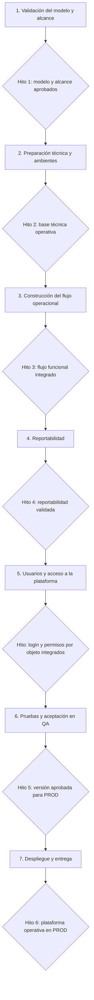

# Cronograma maestro de actividades — visión conceptual

Estado: **propuesta sin línea base aprobada**. Este es el único cronograma del proyecto, desde la validación del modelo hasta la entrega en producción. El Excel editable vigente contiene fechas y duraciones propuestas; la vista Mermaid es solo un resumen.



## 1. Validación del modelo y alcance

- Revisar la matriz TM&PC como antecedente histórico: **análisis realizado**, no fuente funcional vigente.
- Revisar la demo HTML oficial: **análisis realizado**.
- Preparar el diagrama conceptual `DC-001`: **borrador construido**.
- Validar con el cliente entidades, relaciones, etapas, especialidades, controles y traspasos.
- Definir el alcance funcional, entregables y criterios de aceptación de **TM, Precomisionamiento, Comisionamiento y PEM**. La demo no especifica por completo las últimas etapas, por lo que sus líneas base, controles, caminatas, estados, resultados, fórmulas, aprobaciones y gates deben completarse con el cliente.
- **Hito 1:** modelo y alcance de la plataforma aprobados por el cliente.

## 2. Preparación técnica y ambientes

- Revisar y aprobar arquitectura, tecnologías, seguridad, repositorios y estrategia de despliegue.
- Definir ambientes de desarrollo, QA y producción y sus reglas de acceso.
- Configurar IDE y herramientas de desarrollo.
- Crear y configurar el repositorio remoto privado en GitHub; conservar el historial local existente.
- Instalar y fijar las dependencias backend y frontend necesarias.
- Preparar configuración, pruebas automáticas y flujo de integración/despliegue.
- **Hito 2:** repositorio y ambientes operativos, arquitectura documentada y base técnica verificable.

## 3. Construcción del flujo operacional

Para cada componente: diseñar formularios, construir APIs y reglas de negocio, implementar interfaces y ejecutar pruebas unitarias y de integración. Estas tareas son transversales; no se dejan como bloques aislados al final.

1. Proyecto y configuración inicial.
2. Activos y línea base.
3. Etapas y especialidades.
4. Puntos de control, caminatas y aplicabilidad por activo.
5. Resultados, protocolos y evidencias.
6. Operación completa de Precomisionamiento, Comisionamiento y PEM, cada una con su línea base, controles, caminatas, resultados, estados, evidencias y aprobación.
7. Los tres gates: TM → Precom, Precom → Com y Com → PEM, con aprobación, rechazo, entrega y revisión de la etapa receptora.
8. Reglas de negocio y auditoría de las operaciones anteriores.

- **Hito 3:** flujo proyecto → activo → TM → Precom → Com → PEM integrado y demostrable, con controles, resultados y gates de todas las etapas. Es un hito funcional con identidades de prueba; no autoriza QA o PROD antes de integrar accesos.

## 4. Reportabilidad

- Construir dashboards e indicadores operacionales.
- Construir reportes y filtros.
- Construir repositorio documental y exportaciones aprobadas.
- Contrastar indicadores y reportes con datos y reglas validados.
- **Hito 4:** reportabilidad validada contra el flujo operacional.

## 5. Usuarios y acceso a la plataforma

- Definir con el cliente perfiles, acciones y alcance de permisos en **todos** los componentes: plataforma, Proyecto, Activos, Etapas y Especialidades, Puntos de Control y Caminatas, Resultados y Evidencias, Aprobaciones y Traspasos, Reportes y Repositorios.
- Construir inicio y cierre de sesión, recuperación de acceso y administración central de usuarios y perfiles para toda la plataforma.
- Asociar perfiles y permisos a Proyecto, Activos, Etapas/Especialidades, Controles/Caminatas, Resultados/Evidencias, Aprobaciones/Traspasos y Reportes/Repositorios. El caso «Proyecto visible, Activos restringidos» es obligatorio.
- **Hito:** login y permisos por objeto integrados y probados. Solo entonces comienza la aceptación integral.

La implementación de acceso va después de Construcción y Reportabilidad según decisión `DEC-011`. En la preparación técnica se fija el contrato de autorización para evitar rediseños posteriores.

## 6. Pruebas y aceptación en QA

- Desplegar la versión candidata en QA.
- Ejecutar pruebas integrales funcionales, de integración y seguridad.
- Verificar datos, permisos, trazabilidad, rendimiento y recuperación según criterios aprobados.
- Corregir defectos y repetir pruebas de aceptación con el cliente.
- **Hito 5:** versión candidata aceptada por el cliente y autorizada para producción.

## 7. Despliegue y entrega

- Preparar respaldo, migraciones, monitoreo y plan de reversión.
- Desplegar en producción y verificar los recorridos críticos.
- Entregar documentación técnica y funcional.
- Capacitar a usuarios y responsables operacionales.
- **Hito 6:** plataforma operativa en producción, verificada y entregada.

## Datos que faltan para convertirlo en Gantt comprometido

El Excel vigente propone fecha de inicio y término, duración, dependencias, responsable por rol, entregable y criterio de aceptación para cada actividad e hito. Son supuestos de planificación: falta validar alcance, capacidad del equipo, responsables nominales y aceptación del cliente antes de convertirlos en línea base comprometida.

## Escenario de Gantt — 9 de septiembre de 2026 a marzo de 2027

Estado: **propuesta acelerada de alto riesgo, no compromiso contractual**. La fecha de inicio fue informada por el usuario. La fecha límite solicitada ahora es producción el 31 de marzo de 2027. Para sostenerla se comprime Usuarios y acceso, se trabaja por frentes paralelos y se solapan pruebas y aceptación con resultados parciales. La aprobación del cliente, capacidad del equipo y ausencia de defectos críticos son condiciones, no hechos confirmados.

El Excel `planificacion/Cronograma_maestro_cliente_v6.xlsx` es la versión editable vigente de este mismo cronograma. El Mermaid siguiente es una vista resumida de referencia, no una segunda línea base; los días y criterios exactos se validan en el Excel.

```mermaid
gantt
    title Diagrama de actividades Proyecto de gestión de activos
    dateFormat YYYY-MM-DD
    axisFormat %b %Y

    section Levantamiento del modelo inicial
    Revisar Matriz TM&PC                         :done, a1, 2026-09-09, 7d
    Revisar modelo HTML                          :done, a2, 2026-09-09, 7d
    Construcción de diagrama entidad relación    :done, a3, 2026-09-12, 4d
    Validar modelo y alcance con el cliente      :crit, a4, 2026-09-16, 2026-10-01
    Completar reglas Precom Com y PEM            :crit, a5, 2026-09-16, 2026-10-01
    Hito: aprobación del modelo de la plataforma :milestone, h1, 2026-10-02, 0d

    section Preparación de ambiente de trabajo
    Revisar arquitectura ambientes y seguridad  :b1, 2026-09-28, 2026-10-09
    Configuración IDE                            :b2, 2026-10-05, 2026-10-09
    Instalación de librerías backend y frontend  :b3, 2026-10-07, 2026-10-16
    Construcción de repositorio en GitHub        :b4, 2026-10-05, 2026-10-16
    Hito: ambiente de trabajo operativo          :milestone, h2, 2026-10-16, 0d

    section Construcción
    Proyecto                                     :c1, 2026-10-19, 2026-10-30
    Activos                                      :c2, 2026-10-26, 2026-11-13
    Etapas y Especialidades                      :c3, 2026-11-09, 2026-11-27
    Puntos de Control y aplicabilidad            :c4, 2026-11-23, 2026-12-18
    Resultados, protocolos y evidencias          :c5, 2026-12-14, 2027-01-15
    Operación completa de Precom                 :c16, 2026-11-23, 2027-01-15
    Operación completa de Com                    :c17, 2026-12-07, 2027-01-22
    Operación completa de PEM                    :c18, 2026-12-14, 2027-01-29
    Resultados y evidencias Com y PEM            :c20, 2027-01-04, 2027-01-29
    Aprobaciones, entregas y traspasos           :c6, 2027-01-04, 2027-01-29
    Traspasos Precom a Com y Com a PEM           :c19, 2027-01-04, 2027-01-29
    Hito: flujo operacional integrado            :milestone, h3, 2027-01-29, 0d

    section Reportabilidad
    Dashboards, reportes y repositorios          :d1, 2027-01-11, 2027-02-05
    Hito: reportabilidad validada                :milestone, h4, 2027-02-05, 0d

    section Usuarios y acceso a la plataforma
    Definir perfiles, permisos y alcance         :u1, 2027-02-08, 2027-02-12
    Inicio de sesión, cierre y recuperación      :u2, 2027-02-15, 2027-02-26
    Administración de usuarios y perfiles       :u3, 2027-02-15, 2027-02-26
    Hito: identidad transversal operativa        :milestone, uh, 2027-02-26, 0d
    Permisos a Proyecto                          :u10, 2027-02-22, 2027-03-05
    Permisos a Activos                           :u11, 2027-02-22, 2027-03-05
    Permisos a Etapas y Especialidades           :u12, 2027-02-22, 2027-03-05
    Permisos a Controles y Caminatas             :u13, 2027-02-22, 2027-03-05
    Permisos a Resultados y Evidencias           :u14, 2027-03-01, 2027-03-12
    Permisos a Aprobaciones y Traspasos          :u15, 2027-03-01, 2027-03-12
    Permisos a Reportes y Repositorios           :u16, 2027-03-01, 2027-03-12
    Hito: permisos integrados                    :milestone, uh2, 2027-03-12, 0d

    section Pruebas funcionales y de seguridad
    Pruebas unitarias                            :e1, 2026-10-19, 2027-01-29
    Pruebas de integración                       :e2, 2027-03-08, 2027-03-19
    Pruebas funcionales y de seguridad           :e3, 2027-03-15, 2027-03-24
    Hito: versión candidata aprobada             :milestone, h5, 2027-03-24, 0d

    section Despliegue en ambiente QA
    Despliegue y aceptación del cliente          :crit, f1, 2027-03-15, 2027-03-26
    Hito: autorización para PROD                 :milestone, h6, 2027-03-26, 0d

    section Despliegue en ambiente PROD
    Despliegue y verificación                    :crit, g1, 2027-03-29, 2027-03-31
    Hito: plataforma operativa                   :milestone, h7, 2027-03-31, 0d

    section Capacitaciones
    Capacitar usuarios y entregar documentación  :h1a, 2027-03-18, 2027-03-31
```

### Condiciones para validar el escenario de marzo

- Aprobar las reglas de las cuatro etapas y el alcance de la primera entrega al inicio de octubre. Es una fecha propuesta exigente por la definición pendiente.
- Definir responsables y disponibilidad real del cliente y del equipo de desarrollo.
- Construir y demostrar incrementos funcionales durante la ejecución, sin esperar al final del cronograma para recibir retroalimentación.
- Reservar febrero y marzo para usuarios/permisos, QA, corrección, aceptación y despliegue; no para desarrollar módulos esenciales por primera vez.
- El alcance inicial objetivo comprende la operación completa de TM, Precom, Com y PEM. Precom, Com y PEM siguen pendientes de definición detallada; marzo **no debe comprometerse** hasta validar reglas, capacidad y criterios de aceptación.
- Contar con equipos paralelos de acceso, QA e infraestructura, una agenda diaria de aceptación del cliente y decisiones sin retraso. El calendario no tiene una reserva amplia para defectos ni contingencias.
- Si los hitos de octubre o enero se retrasan, revisar la fecha objetivo y el plan con el cliente; no presentar un subconjunto como plataforma completa ni recortar pruebas o seguridad.
